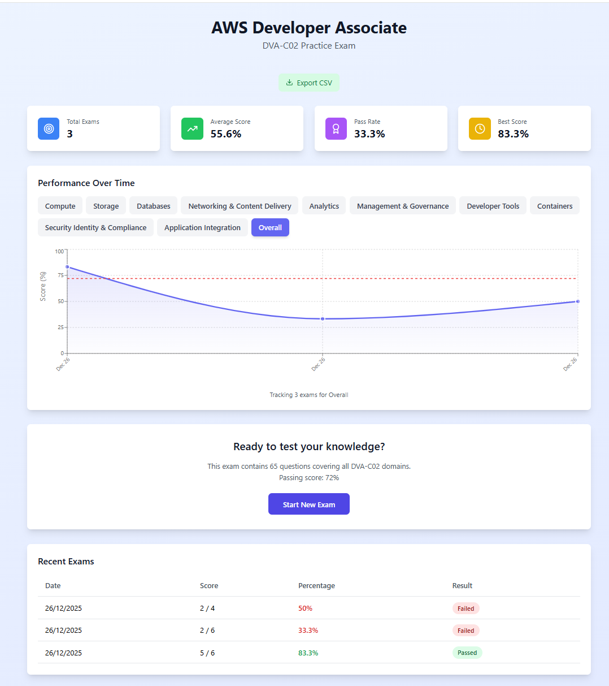
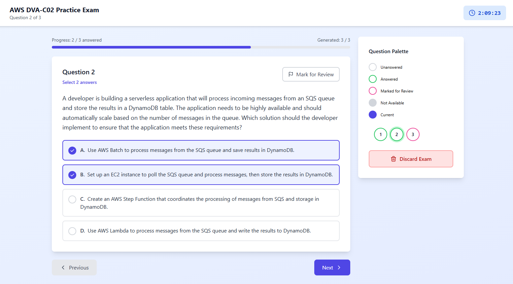
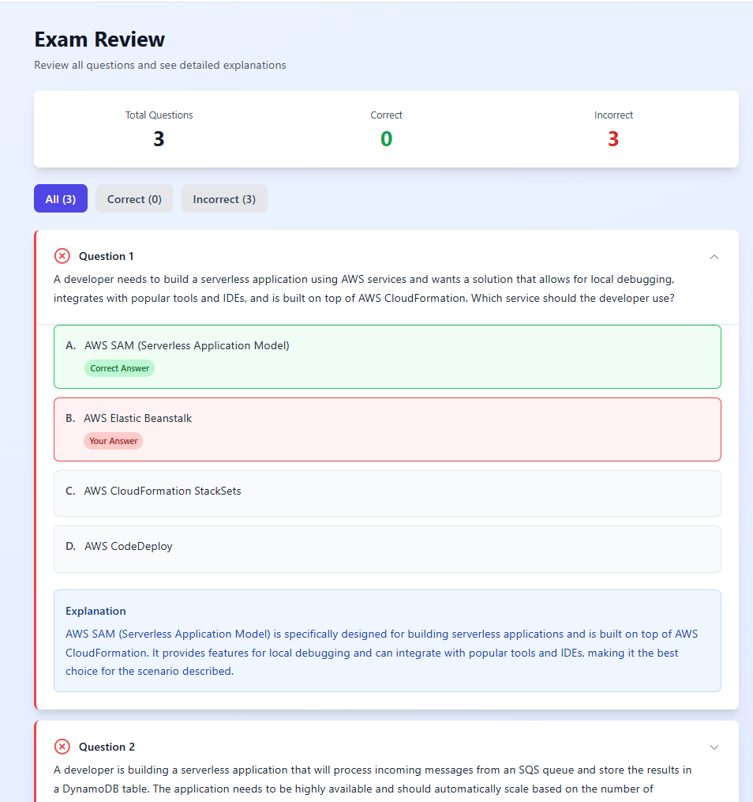

# CloudMentor

CloudMentor is a Retrieval-Augmented Generation (RAG) revision chatbot designed to help prepare for the AWS Certified Developer – Associate exam.
It simulates an exam-style experience using MCQ-based questions generated from handwritten notes, making it a personalised and effective revision tool.

The knowledge base is built from handwritten study notes located in the notes directory. These notes are chunked, embedded using the nomic-embed-text model via Ollama, and stored in a local ChromaDB instance for fast semantic retrieval.

### Setup and Running the Project

- After cloning the project, you'll need to create a `.env` file in the `backend` folder. Within this file, create two variables: the `OPENAI_API_KEY` which you'll need to configure via OpenAI, and `NUM_QUESTIONS`, which determines the number of questions in the exam, 65 being the standard.

- Next, make sure you have Ollama installed, and the embedding model mentioned above pulled locally.

- Next, create a virtual environment for the backend dependencies and install the dependencies from the `requirements.txt` file. From within the `backend` folder, run `python main.py` to start the backend API. Finally travel to the `frontend` folder, run `npm install` to install all the required frontend dependencies and `npm run dev` to run the frontend. Go to `http://localhost:5173/` to see the project dashboard.

- The Dashboard shows a set of statistics about past exam attempts, including a visual chart of your score by exam domain. The Exam page will load questions sequentially, this encourages you to read the question carefully while generating the questions one at a time. Questions are generally 1-answer only, altough some 2- or even 3- answer questions might be occasionally generated. Questions can additionally be marked for review. Once the exam is submitted, a review will be available to let the user see where they went wrong and how to improve.

### Future Work

- If I plan to undertake more certification exams, I will incorporate the notes made while preparing within CloudMentor. Generalising this project to support materials for mutliple MCQ-based certifications should be a straight-forward task as long as the quality of the knowledge-base for the chatbot is good enough.
